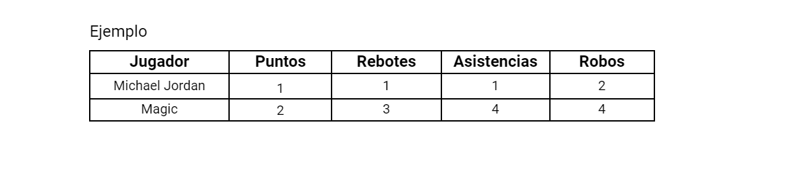

# pp_lab1_Martin_Nicolas_Gustavo
## DREAM TEAM APP
Información: 

Es un programa en Python que carga la información de los jugadores del Dream Team. Al iniciar el programa el usuario accedera a un menú:

El menú permitira realizar diferentes acciones según la opción seleccionada. Los funcionamientos del programa son los suguientes: 

1) Muestra un listado con todos los jugadores del Dream Team. 
El formato es el siguiente:
Nombre Jugador - Posición. 
Ejemplo:
Michael Jordan - Escolta

2) Permite al usuario seleccionar un jugador por su índice y muestra sus estadísticas completas, incluyendo temporadas jugadas, puntos totales, promedio de puntos por partido, rebotes totales, promedio de rebotes por partido, asistencias totales, promedio de asistencias por partido, robos totales, bloqueos totales, porcentaje de tiros de campo, porcentaje de tiros libres y porcentaje de tiros triples.

3) Le permite al usuario buscar un jugador por su nombre y exporta la información del jugador en un archivo CSV. En el archivo CSV se informan los siguientes campos: nombre, posición, temporadas, puntos totales, promedio de puntos por partido, rebotes totales, promedio de rebotes por partido, asistencias totales, promedio de asistencias por partido, robos totales, bloqueos totales, porcentaje de tiros de campo, porcentaje de tiros libres y porcentaje de tiros triples.

4) Permite al usuario buscar un jugador por su nombre y muestra sus logros, como campeonatos de la NBA, participaciones en el All-Star y pertenencia al Salón de la Fama del Baloncesto, etc.

5) Calcula y muestra a todos los jugadores ordenados alfabeticamente y el promedio de puntos por partido de todo el equipo del Dream Team. 

6) Permite al usuario ingresar el nombre de un jugador y muestra si ese jugador es miembro del Salón de la Fama del Baloncesto.

7) Calcula y muestra el jugador con la mayor cantidad de rebotes totales.

8) Calcula y muestra el jugador con el mayor porcentaje de tiros de campo.

9) Calcula y muestra el jugador con la mayor cantidad de asistencias totales.

10) Permite al usuario ingresar un valor y muestra los jugadores que han promediado más puntos por partido que el valor ingfesado.

11) Permite al usuario ingresar un valor y muestra los jugadores que han promediado más rebotes por partido que el valor ingresado.

12) Permite al usuario ingresar un valor y muestra los jugadores que han promediado más asistencias por partido que el valor ingresado.

13) Calcula y muestra el jugador con la mayor cantidad de robos totales.

14) Calcula y muestra el jugador con la mayor cantidad de bloqueos totales.

15) Permite al usuario ingresar un valor y muestra los jugadores que hayan tenido un porcentaje de tiros libres superior al valor ingresado.

16) Calcula y muestra el promedio de puntos por partido del equipo excluyendo al jugador con la menor cantidad de puntos por partido.

17) Calcula y muestra el jugador con la mayor cantidad de logros obtenidos

18) Permite al usuario ingresar un valor y muestra a los jugadores que hayan tenido un porcentaje de tiros triples superior al valor ingresado.

19) Calcula y muestra al jugador con la mayor cantidad de temporadas jugadas

20) Permite al usuario ingresar un valor y mostrar los jugadores , ordenados por posición en la cancha, que hayan tenido un porcentaje de tiros de campo superior a ese valor.

23) Calcula de cada jugador cuál es su posición en cada uno de los siguientes ranking según sus estadísticas y exporta a csv.

Ejemplo

